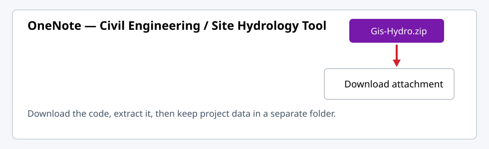
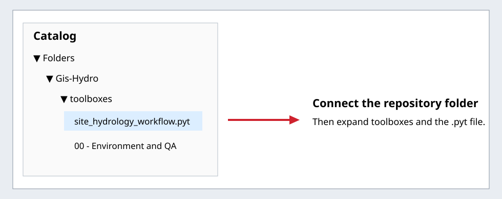
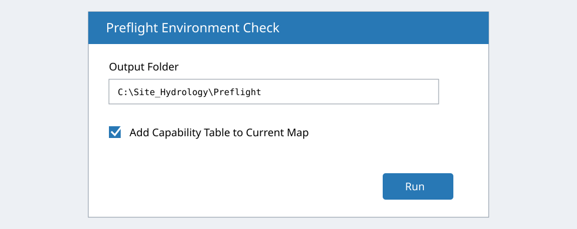
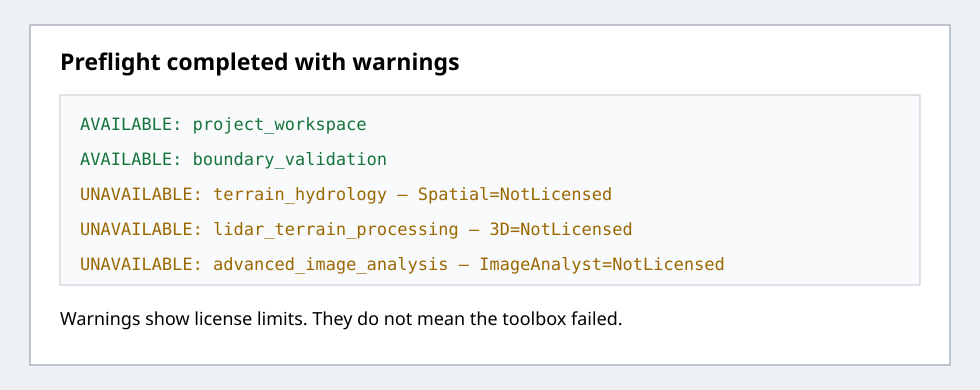

# How I set up the Site Hydrology toolbox in ArcGIS Pro

I wrote this page so another person on the Civil Engineering team can repeat my setup
without using PowerShell or GitHub. The only things needed for the current release are
ArcGIS Pro, the ZIP package I send through an approved company location, and permission
to run a Python toolbox.

> **What this release does today:** it inventories files, validates a boundary, acquires
> configured ArcGIS services, standardizes working data, prepares license-gated drainage
> candidates, screens crossings, and builds a preliminary HEC-RAS review package. I do not
> use any output as final engineering approval.

## How I send the toolbox to another team member

The person receiving the toolbox does not need GitHub. I create one ZIP file on the
development computer and attach that file to a page in our approved OneNote notebook (or
place it in the approved Teams/SharePoint files area and add that link to the OneNote
page).

Before making the ZIP, I close ArcGIS Pro and confirm that the code folder contains no
project boundaries, downloaded agency data, generated reports, credentials, or tokens.
Then I right-click the `Gis-Hydro` folder in File Explorer and select **Compress to ZIP
file**.

On the receiving computer:

1. Open the shared OneNote page.
2. Download the attached `Gis-Hydro.zip` file.
3. In Downloads, right-click the ZIP and select **Extract All**.
4. Move the extracted folder somewhere permanent. I use:

   `C:\Users\<Windows user>\Documents\Gis-Hydro`

Do not save project boundaries, downloaded agency data, or reports inside this code
folder. I keep project work under `C:\Site_Hydrology\Projects`.

## Open the toolbox without a command line

Open the extracted folder and double-click:

`tools\Open Site Hydrology Toolbox.cmd`

The launcher opens the correct `toolboxes` folder and starts ArcGIS Pro. It does not need
administrator rights, install packages, change the ArcGIS Python environment, or copy any
project data.

If the launcher cannot find ArcGIS Pro, open ArcGIS Pro normally and continue below.

## Connect the folder in ArcGIS Pro

1. Open or create a local **Map** project.
2. On the ribbon, select **View > Catalog Pane**.
3. In the Catalog pane, right-click **Folders** and select **Add Folder Connection**.
4. Select the extracted `Gis-Hydro` folder.
5. Expand **Gis-Hydro > toolboxes > site_hydrology_workflow.pyt**.

The first time ArcGIS Pro sees the toolbox, it may show a red exclamation mark. I fixed
that on my workstation by right-clicking `site_hydrology_workflow.pyt`, selecting
**Refresh Python Toolbox Access Permission**, and then selecting **Refresh**.

## Run preflight before the automated workflow

1. Double-click **Preflight Environment Check**.
2. Choose a local output folder outside this repository. For example:

   `C:\Site_Hydrology\Preflight`

3. Leave **Add Capability Table to Current Map** checked.
4. Select **Run**.

The run creates `arcgis_preflight_report.json` and
`arcgis_capability_matrix.csv`. The CSV is also added to the map as a standalone table.

ArcGIS Pro **Advanced** does not automatically include **Spatial Analyst**. Confirm that
the capability report shows `terrain_hydrology=AVAILABLE`. If it does not, request that the
ArcGIS Online administrator assign Spatial Analyst before running terrain processing.

## How I read the result

- **AVAILABLE** means the license check passed for that operation.
- **UNAVAILABLE** means the current license or an extension does not meet the configured
  requirement. It is a warning, not a toolbox crash.
- An Advanced license does not automatically include Spatial Analyst, 3D Analyst, or
  Image Analyst. The preflight checks each extension separately.
- A different team member can use the same toolbox. They will see the functions allowed
  by their own ArcGIS license.

## Run the normal one-dialog workflow

1. Open **00 - START HERE**.
2. Double-click **Automated Site Workflow - KMZ to Review Package**.
3. Enter a project name and select the **parent** projects folder. The tool creates the
   named project folder and `gis\site_hydrology.gdb`.
4. Select the KML/KMZ and choose the project polygon from the populated dropdown.
5. Select the approved CRS and Imperial or Metric units.
6. Choose **Existing Map Layers** to reuse the approved DEM/roads and optional land-cover/
   soil layers already in the map, or **Authoritative Catalog** to acquire configured data.
7. Enter the reviewed stream threshold and fill choice, then run once.
8. Review the elevation and transparent boundary outline in the map and retain the project
   `qa_qc` folder as the traceable run record.

The capability rules are in `config\arcgis_capabilities.yaml`. Any change to a licensing
or engineering rule is **REVIEW REQUIRED** before team rollout.

## Sharing updates with the team

For a one-time handoff, I attach the ZIP to a OneNote page and paste the instructions from
this guide below the attachment. OneNote is organized as **notebook > section > page**;
the handoff instructions belong on a page inside the Civil Engineering team's approved
notebook. For later updates, I attach a newly versioned ZIP instead of silently replacing
the old attachment. Do not overwrite a folder containing project data; project data
should never be stored there.

## Current limit before production use

The connected tools are implemented, but live services, ArcGIS versions, portal access,
large datasets, pagination, datum transformations, and engineering rules still require
controlled validation before department-wide use. The package prepares review inputs; it
does not execute HEC-RAS or produce a final civil engineering decision.
